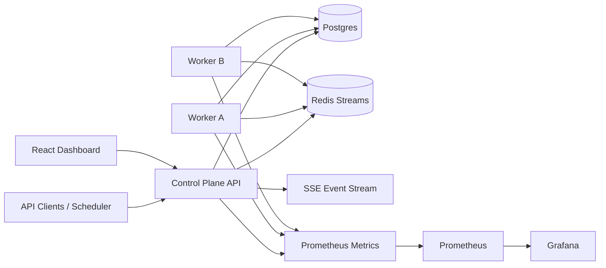

# Workflow Orchestrator

Distributed workflow orchestration platform built as a portfolio project to show end-to-end execution control: DAG validation, durable run/task state, Redis Streams dispatch, worker leases, retries/dead-letter, scheduler triggers, RBAC/rate limits, live dashboard, and production-style observability.

## Problem

Teams often glue together cron jobs, ad hoc queues, and scripts without a single control plane for execution safety. This project focuses on the operational gap:

- Trigger workflows safely and idempotently.
- Execute distributed tasks with crash recovery.
- Surface failures quickly with metrics/events.
- Provide a usable UI for run/task investigation.

## Demo

- Demo GIF: `docs/assets/demo.gif`
- Portfolio walkthrough + tradeoffs: `docs/portfolio.md`


## Architecture



### Reliability Model

- Delivery semantics: at-least-once execution.
- Lease model: workers claim tasks with `lease_expires_at` and heartbeat renewal.
- Recovery: lease reaper re-queues expired tasks or routes terminal failures to dead-letter.
- Retry policy: exponential backoff with bounded attempts.
- Trigger dedupe: `(workflow_id, idempotency_key)` uniqueness prevents duplicate runs.

## Stack

- Runtime: Node.js + TypeScript monorepo (npm workspaces)
- Control plane: Express + Postgres + Redis Streams + node-cron
- Worker: Redis Streams consumer groups + Postgres lease state
- UI: React + Vite
- Observability: Prometheus metrics + Grafana + Loki
- Infra: Docker Compose (local) + Kubernetes manifests (reference deploy)
- Tests: Vitest (unit + integration)

## Screenshots


## Benchmark Results

Latest benchmark artifact: `bench/results/latest.md`

| Metric | Value |
| --- | --- |
| Timestamp | 2026-02-12T01:12:23.648Z |
| Runs | 25 |
| Duration (s) | 15.94 |
| Throughput (runs/s) | 1.57 |
| Succeeded | 25 |
| Failed | 0 |

Regenerate with a live stack:

```bash
npm run bench
```

Structured benchmark source used by this README: `bench/results/latest.json`.

## Quickstart

### 1) Install dependencies

```bash
npm install
```

### 2) Enable commit hooks (recommended for clean history)

```bash
npm run setup:hooks
```

### 3) Configure environment

```bash
cp .env.example .env
```

PowerShell equivalent:

```powershell
Copy-Item .env.example .env
```

### 4) Start infra dependencies

```bash
docker compose up -d
```

### 5) Apply migrations

```bash
npm run -w control-plane migrate
```

### 6) Run services (separate terminals)

```bash
npm run -w control-plane dev
npm run -w worker dev
npm run -w ui dev
```

### 7) Open the dashboard

- UI: `http://localhost:5173`
- API health: `http://localhost:8080/api/health`
- Metrics: `http://localhost:8080/api/metrics`

Default tokens:

- `admin-token`
- `operator-token`
- `viewer-token`

## Quality Gates

```bash
npm run lint
npm run test
npm run build
```

## Evidence Map

| Claim | Evidence |
| --- | --- |
| DAG validation and lifecycle correctness | `shared/tests/dag.test.ts`, `shared/tests/stateMachine.test.ts` |
| Idempotent run triggers prevent duplicate run creation | `control-plane/tests/idempotency.integration.test.ts`, `control-plane/src/api/routes.ts`, `control-plane/migrations/001_init.sql` |
| Retry/backoff and dead-letter recovery for worker failures | `worker/src/executor.ts`, `worker/tests/retry.integration.test.ts`, `docs/postmortems/2026-02-12-worker-crash-drill.md` |
| Lease/heartbeat crash recovery model | `worker/src/executor.ts`, `control-plane/src/recovery/reaper.ts`, `docs/postmortems/2026-02-12-worker-crash-drill.md` |
| Operator visibility in UI and metrics | `ui/tests/app.test.tsx`, `docs/assets/dashboard-runs.png`, `docs/assets/dashboard-tasks.png`, `control-plane/src/metrics/metrics.ts` |
| Throughput claim (1.57 runs/s, 25/25 succeeded) | `bench/results/latest.json`, `bench/results/latest.md` |

## Key Endpoints

- `POST /api/workflows`
- `GET /api/workflows`
- `POST /api/workflows/:workflowId/trigger`
- `GET /api/runs`
- `GET /api/runs/:runId/tasks`
- `POST /api/runs/:runId/cancel`
- `GET /api/events` (SSE)
- `GET /api/metrics`

## Commit Discipline

- Conventional commits only.
- One logical change per commit.
- Commit body includes:
  - `planned-date`
  - `why`
  - `what`
  - `verification`
- No co-author trailers.
- No AI trace text in commit messages.

Commit plan and milestone mapping: `docs/commit-plan.md`

## Additional Docs

- Architecture notes: `docs/architecture.md`
- Queue/recovery ADR: `docs/adr-001-queue-and-recovery.md`
- Operations runbook: `docs/runbook.md`
- Incident drill postmortem: `docs/postmortems/2026-02-12-worker-crash-drill.md`
- Portfolio narrative and resume bullets: `docs/portfolio.md`
